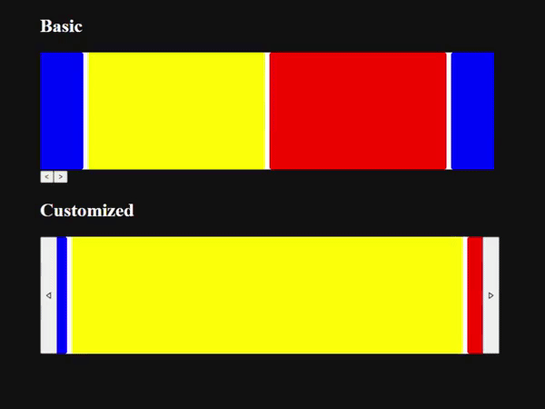

# Overview
A carousel UI implementation for React which is fully customizable.

# Motivation 
Most of carousel UI libarries are usually difficult to customize the UI elements. The libraries generates arrows and pagers by itself and we cannot replace it with our own although many libraries provides some ways to customize style by CSS. In many cases, applying CSS style to the default UI components is not enough for our needs for customization. Then, I created a very basic carousel component that provides wide range customizability.

# How to use
Please check files in `src/CarouselBase` and examples in `App.tsx`. You can copy the files of `CarouselBase` component to your project. I do not have time to make a npm module to share this widely.

# Limitation
The width of each item in a carousel must be the same.